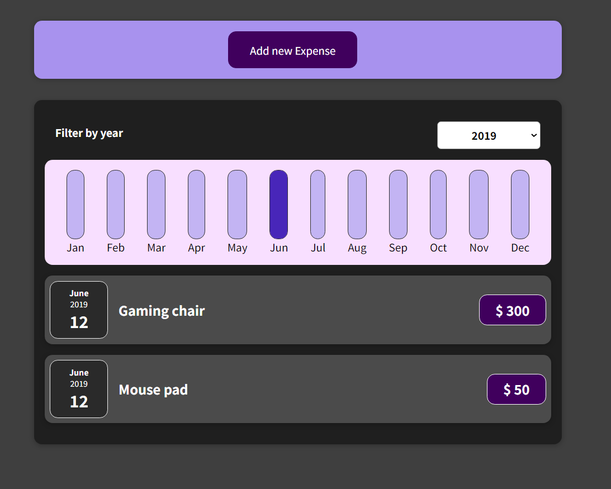

# Expenses Tracker

The Expenses Tracker is a simple web application built using React.js that allows users to track their expenses. With this application, users can add expenses with a title, amount, and date, and filter expenses based on years to view them as a chart.

## Features

- Add an expense: Users can add new expenses by providing a title, amount, and date of the expense.
- Filter expenses: Users can filter expenses based on years to view them as a chart.

## Getting Started

To get started with the Expenses Tracker, follow these steps:

1. Clone the repository to your local machine.
2. Ensure you have Node.js and npm installed on your system.
3. Open a terminal or command prompt and navigate to the project directory.
4. Run `npm install` to install the necessary dependencies.
5. Run `npm start` to start the development server.
6. Open your web browser and navigate to `http://localhost:3000` to access the application.

## How to Use

1. **Adding an Expense**: To add a new expense, click on the "Add Expense" button and fill out the form with the expense details (title, amount, and date). Click "Save" to add the expense to the list.

2. **Filtering Expenses**: To filter expenses based on years, use the filter dropdown or input field (if available) and select the desired year. The expenses for the chosen year will be displayed as a chart.

## Technologies Used

- React.js: A JavaScript library for building user interfaces.
- HTML/CSS: The standard markup language and stylesheets for designing the user interface.
- JavaScript: The programming language used to add functionality to the application.
- npm: The package manager used to install and manage project dependencies.

---

Thank you for using the Expenses Tracker! Happy tracking!
